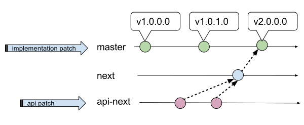
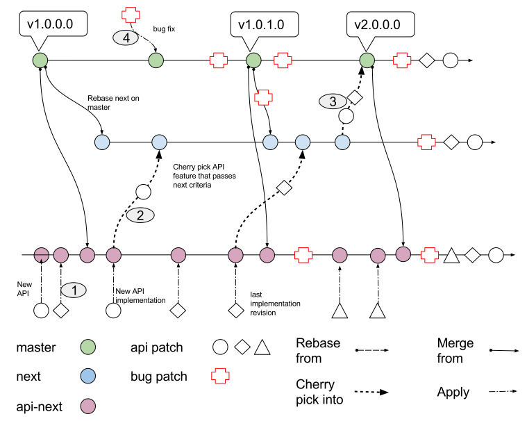

:doctitle: OpenDataPlane (ODP) Release-Guide
:description: This document is intended to guide a new OpenDataPlane +
application developer in understanding the git work flow of the project
:toc:

:numbered!:
[abstract]
Abstract
--------
This document is intended to guide a new application developer in understanding
the git work flow of the project, it relates only to the ODP API work and its
supporting software reference implementation.

Further details about ODP may be found at the http://opendataplane.org[ODP]
home page.

:numbered:

== Release Plan ==
The point and Major (API) releases are on separate cycles with changes that are
potentially backwards incompatible happening at lower frequency. Generation
releases are significantly less frequent. The specific digits used for the
generation and version numbering are described in the ODP API Documentation.
The roles referenced in this document are defined in the
http://www.opendataplane.org/api-documentation/by-laws/[By-laws].

=== Patch to release flow ===
Changes to the API are staged in api-next until they have been sufficiently
reviewed and have met the criteria for inclusion into master for the ODP API.
These new API changes are then staged in next until a release point in master
where a major release is to be made and applied atomically, this flow can be
seen in Figure 1.

.Overview of the ODP git process

Regular bug fixes, and implementation changes occur directly to master.

[[anchor-1]]
== Branch acceptance criteria ==
ODP has three branches one for general bug fixes and improvements on
linux-generic, testing and examples (master). The second branch is for API
development, it contains proposed API changes (api-next) before they are
committed to master. The third is a staging area (next) to gather api-next
cherry picked work so that it may be applied to master on release day, this can
be seen in detail in Figure 2.

.Overview of the ODP git process

=== api-next ===
acceptance criteria for patches to api-next (path 1):

* code compiles
* no regressions introduced
* a new API definition in odp/include may be accepted without an implementation
or tests
* any change to the documentation in odp/include should by default be applied to
api-next but exceptions for simple fixes are allowed

=== next ===
acceptance criteria for patches from api-next to next (path 2):

* code compiles
* no regressions introduced
* the new API has relevant validation tests and tests must pass in the CI loop
* all new APIs have to be approved by the Release Manager to be cherry picked
to next branch
* patches cannot be accepted directly into next

=== master ===
acceptance criteria for patches to master (path 4):

* all changes that do not affect odp/include may be directly applied to master
** bug fixes
** improvements

== Repository management ==
The following describes the behavior to be expected in the branches of the
repository.

All patches are acknowledged on the list as soon as they have been applied to
the repository.

=== api-next ===
* api-next is always rebased on top of master when there is a release point in
master
* an API change being accepted into api-next is not a guarantee that it will
one day make it into the released API. This is a staging branch and changes may
be reverted without ever being merged
* changes that introduce a regression in compilation or execution need to be
justified
* api-next is = latest master + these proposed API changes
* all patches that apply to the code in odp/include must be applied to api-next
first
* an applied patch that is later justified can be cherry picked to master
without waiting for a Major or Generation release if it is shown to not be a
backwards compatibility issue

=== next ===
* next is always rebased on top of master at each release point in master
* new APIs are cherry picked into next from api-next when approved by the
Release Manager and Maintainer

=== master ===
* tagging is only done when the Release Manager and Maintainers agree
* this branch is released at a period approximately once a month
* this branch will never have its history rewritten
* code is merged on release day from next to master, tagged and released as
atomically as possible
* the maintainer assures that there are not obvious regressions
* the maintainer generates the API change log
* the maintainer updates the version number
* the maintainer tags the master branch

== Releases ==
All releases are from master.

They are tagged in the repository using the format
v<Generation>.<Major>.<Minor>.<Impl>
There are three release types with differing frequencies and impact to the
applications.

=== Generation releases ===
A generation release indicates a major completion of work, and a possible
change in direction for the API. Same as for Major release plus they are
defined by the Steering committee.

=== Major releases ===
Major (API) releases are scheduled to be about once a
quarter, but when there is significant progress made they may be more frequent.

=== Point releases ===
General bug fixes and other non API altering changes are gathered and a release
made every month if sufficient change has accumulated.

=== Implementation (Impl) ===
Platform specific free form text relating to the version.

== Deprecating part of the API
Deleting or changing the published API follows the normal <<anchor-1,process>>, with the following additional rules:

* A deprecated indication is applied to the old API using the @deprecated
doxygen syntax.
* For a function change the old API it is additionally marked using the
ODP_DEPRECATED preprocessor macro.
* The CHANGELOG will have an entry in the API change section.
* The Release Manager will resolve the duration for which the deprecated API.
will be supported, and determine which future release it will be applied to. +

The more complex use cases are elaborated below.

=== Changing  a function
A new function will be added with the new behavior. The old function will remain and be marked by both a documentation entry and a compiler warning.
For a function change the new API will be used in the examples, test/performance and
test/miscellaneous directories.
The new API must have comparable coverage to the old API.

[source,c]
----
/**
 * Create a foo
 *
 * @deprecated This API needs to take a count and will be deleted.
 * The replacement API will be odp_bar_create();
 *
 * @param name ...
 */
odp_foo_t odp_foo_create(const char *name) ODP_DEPRECATED;

/**
 * Create a bar
 *
 * @param name ...
 */
odp_foo_t odp_bar_create(const char *name, int count);
----

=== Deleting a function
When deleting a function it will be be indicated in the documentation and via a
compiler warning.

[source,c]
----
/**
 * Create a foo
 *
 * @deprecated This API will be removed because platforms now take care of this
 *
 * @param name ...
 */
odp_foo_t odp_foo_create(const char *name) ODP_DEPRECATED;
----

=== Changing a struct member
When changing a struct member it will be indicated in the documentation.

[source,c]
----
/**
 * An initialization struct
 */
typedef struct foo_init_t {
	/** Maximum number of worker threads */
	int num_worker;

	/**
	 * Maximum number of control threads
	 * @deprecated this is now number_of_control
	 */
	int num_control;
	int other_items;
	int number_of_control;
----

The implementation of the structs initialization function must be updated to cover the new element.
[source,c]
----
void odp_foo_param_init(foo_init_t param) {
	...
	param->number_of_control = 20;
}
----

=== Deleting a struct member
When deleting a struct member it will be indicated in the documentation.

[source,c]
----
/**
 * An initialization struct
 */
typedef struct foo_init_t {
	/** Maximum number of worker threads */
	int num_worker;

	/**
	 * Maximum number of control threads
	 * @deprecated this is no longer needed, it is automatically inferred.
	 */
	int num_control;
	int other_items;
----
