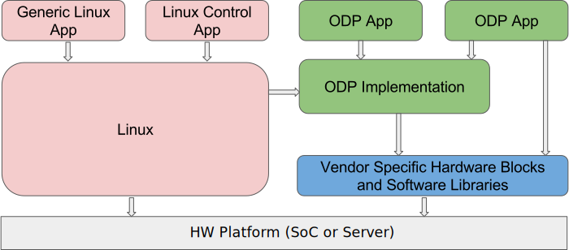
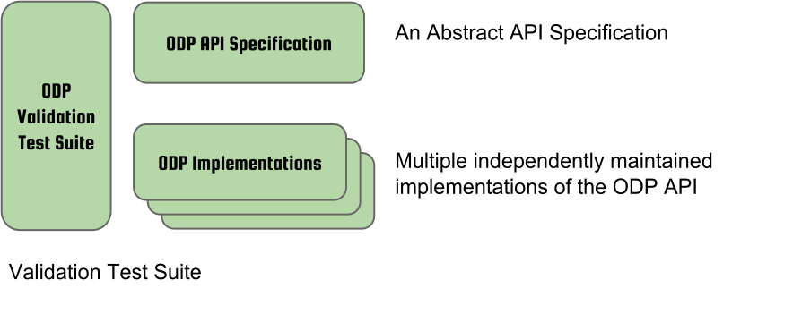
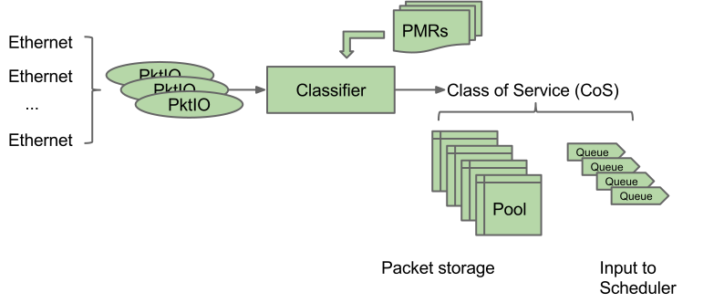
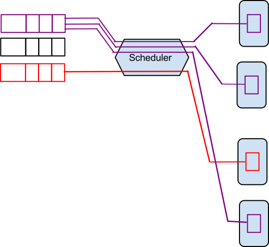
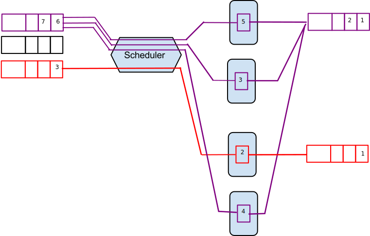

:doctitle: OpenDataPlane (ODP) Users-Guide
:description: This document is intended to guide a new OpenDataPlane +
application developer.
:toc:

:numbered!:
[abstract]
Abstract
--------
This document is intended to guide a new ODP application developer.
Further details about ODP may be found at the http://opendataplane.org[ODP]
home page.

.Overview of a system running ODP applications

ODP is an API specification that allows many implementations to provide
platform independence, automatic hardware acceleration and CPU scaling to
high performance networking  applications. This document describes how to
write an application that can successfully take advantage of the API.

:numbered:
== Introduction
.OpenDataPlane Components

.The ODP API Specification
ODP consists of three separate but related component parts. First, ODP is an
abstract API specification that describes a functional model for
data plane applications. This specification covers many common data plane
application programming needs, such as the ability to receive, manipulate, and
transmit packet data, without specifying how these functions are performed. This
is quite intentional. It is precisely because ODP APIs do not have a preferred
embodiment that they permit innovation in how these functions can
be realized on various platforms that offer implementations of ODP. To achieve
this goal, ODP APIs are described using abstract data types whose definition
is left up to the ODP implementer.  For example, in ODP packets are referenced
by abstract handles of type +odp_packet_t+, and packet-related APIs take
arguments of this type. What an +odp_packet_t+ actually is is not part of the
ODP API specification--that is the responsibility of each ODP implementation.

.Summary: ODP API attributes:
* Open Source, open contribution, BSD-3 licensed.
* Vendor and platform neutral.
* Application-centric.  Covers functional needs of data plane applications.
* Ensures portability by specifying the functional behavior of ODP.
* Defined jointly and openly by application writers and platform implementers.
* Architected to be implementable on a wide range of platforms efficiently
* Sponsored, governed, and maintained by the Linaro Networking Group (LNG)

.ODP Implementations
Second, ODP consists of multiple implementations of this API specification,
each tailored to a specific target platform. ODP implementations determine
how each ODP abstract type is represented on that platform and how each ODP
API is realized. On some platforms, ODP APIs will
be realized using specialized instructions that accelerate the functional
behavior specified by the API. On others, hardware co-processing engines may
completely offload the API so that again it can be performed with little or no
involvement by a CPU. In all cases, the application sees the same
functional behavior independent of how a given platform has chosen to realize
it. By allowing each platform the freedom to determine how best to realize each
API's specified functional behavior in an optimal manner, ODP permits
applications written to its APIs to take full advantage of the unique
capabilities of each platform without the application programmer needing to
have specialist knowledge of that platform or to be concerned with how best
to tune the application to a particular platform. This latter consideration is
particularly important in Network Function Virtualization (NFV) environments
where the application will run on a target platform chosen by someone else.

.Summary: ODP Implementation Characteristics
* One size does not fit all--supporting multiple implementations allows ODP
to adapt to widely differing internals among platforms.
* Anyone can create an ODP implementation tailored to their platform
* Distribution and maintenance of each implementation is as owner wishes
  - Open source or closed source as business needs determine
  - Have independent release cycles and service streams
* Allows HW and SW innovation in how ODP APIs are implemented on each platform.

.Reference Implementations
To make it easy to get started with implementing ODP on a new platform, ODP
supplies a number of _reference implementations_ that can serve as a
starting point.  The two primary references implementations supplied by ODP are
*odp-linux* and *odp-dpdk*

.odp-linux
The *odp-linux* reference implementation is a pure SW implementation of the
ODP API that relies only on the Linux programming API. As a functional model
for ODP, it enables ODP to be bootstrapped easily to any platform that
supports a Linux kernel.

.odp-dpdk
The *odp-dpdk* reference implementation is a pure SW implementation of the
ODP API that uses http://dpdk.org[DPDK] as a SW accelerator. In particular,
*odp-dpdk* offers superior I/O performance for systems that use NICs, allowing
ODP applications to take immediate full advantage of the various NIC device
drivers supported by DPDK.

.Summary: ODP Reference Implementations
* Open source, open contribution, BSD-3 licensed.
* Provide easy bootstrapping of ODP onto new platforms
* Implementers free to borrow or tailor code as needed for their platform
* Implementers retain full control over their implementations whether or not
they are derived from a reference implementation.

.ODP Validation Test Suite
Third, to ensure consistency between different ODP implementations, ODP
consists of a validation suite that verifies that any given implementation of
ODP faithfully provides the specified functional behavior of each ODP API.
As a separate open source component, the validation suite may be used by
application writers, system integrators, and platform providers alike to
confirm that any purported implementation of ODP does indeed conform to the
ODP API specification.

.Summary: ODP Validation Test Suite
* Synchronized with ODP API specification
* Maintained and distributed by LNG
* Open source, open contribution, BSD-3 licensed.
* Key to ensuring application portability across all ODP implementations
* Tests that ODP implementations conform to the specified functional behavior
of ODP APIs.
* Can be run at any time by users and vendors to validate implementations
of ODP.

=== ODP API Specification Versioning
As an evolving standard, the ODP API specification is released under an
incrementing version number, and corresponding implementations of ODP, as well
as the validation suite that verifies API conformance, are linked to this
version number. ODP versions are specified using a standard three-level
number (major.minor.fixlevel) that are incremented according to the degree of
change the level represents. Increments to the fix level represent clarification
of the specification or other minor changes that do not affect either the
syntax or semantics of the specification. Such changes in the API specification
are expected to be rare. Increments to the minor level
represent the introduction of new APIs or functional capabilities, or changes
to he specified syntax or functional behavior of APIs and thus may require
application source code changes. Such changes are well documented in the
release notes for each revision of the specification. Finally, increments to
the major level represent significant structural changes that most likely
require some level of application source code change, again as documented in
the release notes for that version.

=== ODP Implementation Versioning
ODP implementations are free to use whatever release naming/numbering
conventions they wish, as long as it is clear what level of the ODP API a given
release implements. A recommended convention is to use the same three level
numbering scheme where the major and minor numbers correspond to the ODP API
level and the fix level represents an implementation-defined service level
associated with that API level implementation. The LNG-supplied ODP reference
implementations follow this convention.

=== ODP Validation Test Suite Versioning
The ODP validation test suite follows these same naming conventions. The major
and minor release numbers correspond to the ODP API level that the suite
validates and the fix level represents the service level of the validation
suite itself for that API level.

=== ODP Design Goals
ODP has three primary goals that follow from its component structure. The first
is application portability across a wide range of platforms. These platforms
differ in terms of processor instruction set architecture, number and types of
application processing cores, memory organization, as well as the number and
type of platform specific hardware acceleration and offload features that
are available. ODP applications can move from one conforming implementation
to another with at most a recompile.

Second, ODP is designed to permit data plane applications to avail themselves
of platform-specific features, including specialized hardware accelerators,
without specialized programming. This is achieved by separating the API
specification from their implementation on individual platforms. Since each
platform implements each ODP API in a manner optimal to that platform,
applications automatically gain the benefit of such optimizations without the
need for explicit programming.

Third, ODP is designed to allow applications to scale out automatically to
support many core architectures. This is done using an event based programming
model that permits applications to be written to be independent of the number
of processing cores that are available to realize application function. The
result is that an application written to this model does not require redesign
as it scales from 4, to 40, to 400 cores.

== Organization of this Document
This document is organized into several sections. The first presents a high
level overview of the ODP API component areas and their associated abstract
data types. This section introduces ODP APIs at a conceptual level.
The second provides a tutorial on the programming model(s)
supported by ODP, paying particular attention to the event model as this
represents the preferred structure for most ODP applications. This section
builds on the concepts introduced in the first section and shows how ODP
applications are structured to best realize the three ODP design goals
mentioned earlier. The third section provides a more detailed overview of
the major ODP API components and is designed to serve as a companion to the
full reference specification for each API. The latter is intended to be used
by ODP application programmers, as well as implementers, to understand the
precise syntax and semantics of each API.

== ODP API Concepts
ODP programs are built around several conceptual structures that every
application programmer needs to be familiar with to use ODP effectively. The
main ODP concepts are:
Thread, Event, Queue, Pool, Shared Memory, Buffer, Packet, PktIO, Time, Timer,
and Synchronizer.

=== Thread
The thread is the fundamental programming unit in ODP.  ODP applications are
organized into a collection of threads that perform the work that the
application is designed to do. ODP threads may or may not share memory with
other threads--that is up to the implementation. Threads come in two "flavors":
control and worker, that are represented by the abstract type
+odp_thread_type_t+.

A control thread is a supervisory thread that organizes
the operation of worker threads. Worker threads, by contrast, exist to
perform the main processing logic of the application and employ a run to
completion model. Worker threads, in particular, are intended to operate on
dedicated processing cores, especially in many core processing environments,
however a given implementation may multitask multiple threads on a single
core if desired (typically on smaller and lower performance target
environments).

In addition to thread types, threads have associated _attributes_ such as
_thread mask_ and _scheduler group_ that determine where they can run and
the type of work that they can handle. These will be discussed in greater
detail later.

=== Event
Events are what threads process to perform their work. Events can represent
new work, such as the arrival of a packet that needs to be processed, or they
can represent the completion of requests that have executed asynchronously.
Events can also represent notifications of the passage of time, or of status
changes in various components of interest to the application. Events have an
event type that describes what it represents. Threads can create new events
or consume events processed by them, or they can perform some processing on
an event and then pass it along to another component for further processing.
References to events are via handles of abstract type +odp_event_t+. Cast
functions are provided to convert these into specific handles of the
appropriate type represented by the event.

=== Queue
A queue is a message passing channel that holds events.  Events can be
added to a queue via enqueue operations or removed from a queue via dequeue
operations. The endpoints of a queue will vary depending on how it is used.
Queues come in two major types: polled and scheduled, which will be
discussed in more detail when the event model is introduced. Queues may also
have an associated context, which represents a persistent state for all
events that make use of it. These states are what permit threads to perform
stateful processing on events as well as stateless processing.

Queues are represented by handles of abstract type +odp_queue_t+.

=== Pool
A pool is a shared memory area from which elements may be drawn. Pools
represent the backing store for events, among other things. Pools are
typically created and destroyed by the application during initialization and
termination, respectively, and then used during processing. Pools may be
used by ODP components exclusively, by applications exclusively, or their
use may be shared between the two. Pools have an associated type that
characterizes the elements that they contain. The two most important pool types
are Buffer and Packet.

Pools are represented by handles of abstract type +odp_pool_t+.

=== Shared Memory
Shared memory represents raw blocks of storage that are sharable between
threads. They are the building blocks of pools but can be used directly by
ODP applications if desired.

Shared memory is represented by handles of abstract type +odp_shm_t+.

=== Buffer
A buffer is a fixed sized block of shared storage that is used by ODP
components and/or applications to realize their function. Buffers contain
zero or more bytes of application data as well as system maintained
metadata that provide information about the buffer, such as its size or the
pool it was allocated from. Metadata is an important ODP concept because it
allows for arbitrary amounts of side information to be associated with an
ODP object. Most ODP objects have associated metadata and this metadata is
manipulated via accessor functions that act as getters and setters for
this information. Getter access functions permit an application to read
a metadata item, while setter access functions permit an application to write
a metadata item. Note that some metadata is inherently read only and thus
no setter is provided to manipulate it.  When object have multiple metadata
items, each has its own associated getter and/or setter access function to
inspect or manipulate it.

Buffers are represented by handles of abstract type +odp_buffer_t+.

=== Packet
Packets are received and transmitted via I/O interfaces and represent
the basic data that data plane applications manipulate.
Packets are drawn from pools of type +ODP_POOL_PACKET+.
Unlike  buffers, which are simple objects,
ODP packets have a rich set of semantics that permit their inspection
and manipulation in complex ways to be described later. Packets also support
a rich set of metadata as well as user metadata. User metadata permits
applications to associate an application-determined amount of side information
with each packet for its own use.

Packets are represented by handles of abstract type +odp_packet_t+.

=== PktIO
PktIO is how ODP represents I/O interfaces. A pktio object is a logical
port capable of receiving and/or transmitting packets. This may be directly
supported by the underlying platform as an integrated feature,
or may represent a device attached via a PCIE or other bus.

PktIOs are represented by handles of abstract type +odp_pktio_t+.

=== Time
The time API is used to measure time intervals and track time flow of an
application and presents a convenient way to get access to a time source.
The time API consists of two main parts: local time API and global time API.

==== Local time
The local time API is designed to be used within one thread and can be faster
than the global time API. The local time API cannot be used between threads as
time consistency is not guaranteed, and in some cases that's enough.
So, local time stamps are local to the calling thread and must not be shared
with other threads. Current local time can be read with +odp_time_local()+.

==== Global time
The global time API is designed to be used for tracking time between threads.
So, global time stamps can be shared between threads. Current global time can
be read with +odp_time_global()+.

Both, local and global time is not wrapped during the application life cycle.
The time API includes functions to operate with time, such as +odp_time_diff()+,
+odp_time_sum()+, +odp_time_cmp()+, conversion functions like
+odp_time_to_ns()+, +odp_time_local_from_ns()+, +odp_time_global_from_ns()+.
To get rate of time source +odp_time_local_res()+, +odp_time_global_res()+
are used. To wait, +odp_time_wait_ns()+ and +odp_time_wait_until()+ are used,
during witch a thread potentially busy loop the entire wait time.

The +odp_time_t+ opaque type represents local or global timestamps.

=== Timer
Timers are how ODP applications measure and respond to the passage of time.
Timers are drawn from specialized pools called timer pools that have their
own abstract type (+odp_timer_pool_t+). Applications may have many timers
active at the same time and can set them to use either relative or absolute
time. When timers expire they create events of type +odp_timeout_t+, which
serve as notifications of timer expiration.

=== Synchronizer
Multiple threads operating in parallel typically require various
synchronization services to permit them to operate in a reliable and
coordinated manner. ODP provides a rich set of locks, barriers, and similar
synchronization primitives, as well as abstract types for representing various
types of atomic variables. The ODP event model also makes use of queues to
avoid the need for explicit locking in many cases. This will be discussed
in the next section.

== ODP Components ==
Building on ODP concepts, ODP offers several components that relate to the
flow of work through an ODP application. These include the Classifier,
Scheduler, and Traffic Manager.  These components relate to the three
main stages of packet processing: Receive, Process, and Transmit.

=== Classifier
The *Classifier* provides a suite of APIs that control packet receive (RX)
processing.

.ODP Receive Processing with Classifier

The classifier provides two logically related services:
[horizontal]
Packet parsing:: Verifying and extracting structural information from a
received packet.

Packet classification:: Applying *Pattern Matching Rules (PMRs)* to the
parsed results to assign an incoming packet to a *Class of Service (CoS)*.

Combined, these permit incoming packets to be sorted into *flows*, which are
logically related sequences of packets that share common processing
requirements. While many data plane applications perform stateless packet
processing (_e.g.,_ for simple forwarding) others perform stateful packet
processing.  Flows anchor state information relating to these groups of
packets.

A CoS determines two variables for packets belonging to a flow:
[list]
* The pool that they will be stored in on receipt
* The queue that they will be added to for processing

The PMRs supported by ODP permit flow determination based on combinations of
packet field values (tuples). The main advantage of classification is that on
many platforms these functions are performed in hardware, meaning that
classification occurs at line rate as packets are being received without
any explicit processing by the ODP application.

Note that the use of the classifier is optional.  Applications may directly
receive packets from a corresponding PktIO input queue via direct polling
if they choose.

=== Scheduler
The *Scheduler* provides a suite of APIs that control scalable event
processing.

.ODP Scheduler and Event Processing
image::../images/odp_scheduling.svg[align="center"]

The Scheduler is responsible for selecting and dispatching one or more events
to a requesting thread. Event selection is based on several factors involving
both the queues containing schedulable events and the thread making an
+odp_schedule()+ or +odp_schedule_multi()+ call.

ODP queues have a _scheduling priority_ that determines how urgently events
on them should be processed relative to events contained in other queues.
Queues also have a _scheduler group id_ associated with them that must match
the associated scheduler group _thread mask_ of the thread calling the
scheduler. This permits events to be grouped for processing into classes and
have threads that are dedicated to processing events from specified classes.
Threads can join and leave scheduler groups dynamically, permitting easy
application response to increases in demand.

When a thread receives an event from the scheduler, it in turn can invoke
other processing engines via ODP APIs (_e.g.,_ crypto processing) that
can operate asynchronously. When such processing is complete, the result is
that a *completion event* is added to a schedulable queue where it can be
scheduled back to a thread to continue processing with the results of the
requested asynchronous operation.

Threads themselves can enqueue events to queues for downstream processing
by other threads, permitting flexibility in how applications structure
themselves to maximize concurrency.

=== Traffic Manager
The *Traffic Manager* provides a suite of APIs that control traffic shaping and
Quality of Service (QoS) processing for packet output.

.ODP Transmit processing with Traffic Manager
image::../images/odp_traffic_manager.svg[align="center"]

The final stage of packet processing is to transmit it. Here, applications have
several choices.  As with RX processing, applications may send packets
directly to PktIO TX queues for direct transmission.  Often, however,
applications need to perform traffic shaping and related
*Quality of Service (QoS)* processing on the packets comprising a flow as part
of transmit processing. To handle this need, ODP provides a suite of
*Traffic Manager* APIs that permit programmatic establishment of arbiters,
shapers, etc. that control output packet processing to achieve desired QoS
goals. Again, the advantage here is that on many platforms traffic management
functions are implemented in hardware, permitting transparent offload of
this work.

== ODP Application Programming
At the highest level, an *ODP Application* is a program that uses one or more
ODP APIs. Because ODP is a framework rather than a programming environment,
applications are free to also use other APIs that may or may not provide the
same portability characteristics as ODP APIs.

ODP applications vary in terms of what they do and how they operate, but in
general all share the following characteristics:

. They are organized into one or more _threads_ that execute in parallel.
. These threads communicate and coordinate their activities using various
_synchronization_ mechanisms.
. They receive packets from one or more _packet I/O interfaces_.
. They examine, transform, or otherwise process packets.
. They transmit packets to one or more _packet I/O interfaces_.

ODP provides APIs to assist in each of these areas.

=== The include structure
Applications only include the 'include/odp.h' file, which includes the
'platform/<implementation name>/include/odp' files to provide a complete
definition of the API on that platform. The doxygen documentation defining
the behavior of the ODP API is all contained in the public API files, and the
actual definitions for an implementation will be found in the per platform
directories. Per-platform data that might normally be a +#define+ can be
recovered via the appropriate access function if the #define is not directly
visible to the application.

.Users include structure
----
./
├── include/
│   ├── odp/
│   │   └── api/
│   │       └── The Public API and the documentation.
│   │
│   └── odp.h   This file should be the only file included by the application.
----

=== Initialization
IMPORTANT: ODP depends on the application to perform a graceful shutdown,
calling the terminate functions should only be done when the application is
sure it has closed the ingress and subsequently drained all queues, etc.

=== Startup
The first API that must be called by an ODP application is 'odp_init_global()'.
This takes two pointers. The first, +odp_init_t+, contains ODP initialization
data that is platform independent and portable, while the second,
+odp_platform_init_t+, is passed unparsed to the implementation
to be used for platform specific data that is not yet, or may never be
suitable for the ODP API.

Calling odp_init_global() establishes the ODP API framework and MUST be
called before any other ODP API may be called. Note that it is only called
once per application. Following global initialization, each thread in turn
calls 'odp_init_local()' is called. This establishes the local ODP thread
context for that thread and MUST be called before other ODP APIs may be
called by that thread.

=== Shutdown
Shutdown is the logical reverse of the initialization procedure, with
'odp_term_local()' called for each thread before 'odp_term_global()' is
called to terminate ODP.

.ODP Application Structure Flow Diagram
image::../images/resource_management.svg[align="center"]

== Common Conventions
Many ODP APIs share common conventions regarding their arguments and return
types. This section highlights some of the more common and frequently used
conventions.

=== Handles and Special Designators
ODP resources are represented via _handles_ that have abstract type
_odp_resource_t_.  So pools are represented by handles of type +odp_pool_t+,
queues by handles of type +odp_queue_t+, etc. Each such type
has a distinguished type _ODP_RESOURCE_INVALID_ that is used to indicate a
handle that does not refer to a valid resource of that type. Resources are
typically created via an API named _odp_resource_create()_ that returns a
handle of type _odp_resource_t_ that represents the created object. This
returned handle is set to _ODP_RESOURCE_INVALID_ if, for example, the
resource could not be created due to resource exhaustion. Invalid resources
do not necessarily represent error conditions. For example, +ODP_EVENT_INVALID+
in response to an +odp_queue_deq()+ call to get an event from a queue simply
indicates that the queue is empty.

=== Addressing Scope
Unless specifically noted in the API, all ODP resources are global to the ODP
application, whether it runs as a single process or multiple processes. ODP
handles therefore have common meaning within an ODP application but have no
meaning outside the scope of the application.

=== Resources and Names
Many ODP resource objects, such as pools and queues, support an
application-specified character string _name_ that is associated with an ODP
object at create time.  This name serves two purposes: documentation, and
lookup. The lookup function is particularly useful to allow an ODP application
that is divided into multiple processes to obtain the handle for the common
resource.

== Queues
Queues are the fundamental event sequencing mechanism provided by ODP and all
ODP applications make use of them either explicitly or implicitly. Queues are
created via the 'odp_queue_create()' API that returns a handle of type
+odp_queue_t+ that is used to refer to this queue in all subsequent APIs that
reference it. Queues have one of two ODP-defined _types_, POLL, and SCHED that
determine how they are used. POLL queues directly managed by the ODP
application while SCHED queues make use of the *ODP scheduler* to provide
automatic scalable dispatching and synchronization services.

.Operations on POLL queues
[source,c]
----
odp_queue_t poll_q1 = odp_queue_create("poll queue 1", ODP_QUEUE_TYPE_POLL, NULL);
odp_queue_t poll_q2 = odp_queue_create("poll queue 2", ODP_QUEUE_TYPE_POLL, NULL);
...
odp_event_t ev = odp_queue_deq(poll_q1);
...do something
int rc = odp_queue_enq(poll_q2, ev);
----

The key distinction is that dequeueing events from POLL queues is an
application responsibility while dequeueing events from SCHED queues is the
responsibility of the ODP scheduler.

.Operations on SCHED queues
[source,c]
----
odp_queue_param_t qp;
odp_queue_param_init(&qp);
odp_schedule_prio_t prio = ...;
odp_schedule_group_t sched_group = ...;
qp.sched.prio = prio;
qp.sched.sync = ODP_SCHED_SYNC_[NONE|ATOMIC|ORDERED];
qp.sched.group = sched_group;
qp.lock_count = n; /* Only relevant for ordered queues */
odp_queue_t sched_q1 = odp_queue_create("sched queue 1", ODP_QUEUE_TYPE_SCHED, &qp);

...thread init processing

while (1) {
        odp_event_t ev;
        odp_queue_t which_q;
        ev = odp_schedule(&which_q, <wait option>);
        ...process the event
}
----

With scheduled queues, events are sent to a queue, and the the sender chooses
a queue based on the service it needs. The sender does not need to know
which ODP thread (on which core) or hardware accelerator will process
the event, but all the events on a queue are eventually scheduled and processed.

As can be seen, SCHED queues have additional attributes that are specified at
queue create that control how the scheduler is to process events contained
on them. These include group, priority, and synchronization class.

=== Scheduler Groups
The scheduler's dispatching job is to return the next event from the highest
priority SCHED queue that the caller is eligible to receive events from.
This latter consideration is determined by the queues _scheduler group_, which
is set at queue create time, and by the caller's _scheduler group mask_ that
indicates which scheduler group(s) it belongs to. Scheduler groups are
represented by handles of type +odp_scheduler_group_t+ and are created by
the *odp_scheduler_group_create()* API. A number of scheduler groups are
_predefined_ by ODP.  These include +ODP_SCHED_GROUP_ALL+ (all threads),
+ODP_SCHED_GROUP_WORKER+ (all worker threads), and +ODP_SCHED_GROUP_CONTROL+
(all control threads). The application is free to create additional scheduler
groups for its own purpose and threads can join or leave scheduler groups
using the *odp_scheduler_group_join()* and *odp_scheduler_group_leave()* APIs

=== Scheduler Priority
The +prio+ field of the +odp_queue_param_t+ specifies the queue's scheduling
priority, which is how queues within eligible scheduler groups are selected
for dispatch. Queues have a default scheduling priority of NORMAL but can be
set to HIGHEST or LOWEST according to application needs.

=== Scheduler Synchronization
In addition to its dispatching function, which provide automatic scalability to
ODP applications in many core environments, the other main function of the
scheduler is to provide event synchronization services that greatly simplify
application programming in a parallel processing environment. A queue's
SYNC mode determines how the scheduler handles the synchronization processing
of multiple events originating from the same queue.

Three types of queue scheduler synchronization area supported: Parallel,
Atomic, and Ordered.

==== Parallel Queues
SCHED queues that specify a sync mode of ODP_SCHED_SYNC_NONE are unrestricted
in how events are processed.

.Parallel Queue Scheduling

All events held on parallel queues are eligible to be scheduled simultaneously
and any required synchronization between them is the responsibility of the
application. Events originating from parallel queues thus have the highest
throughput rate, however they also potentially involve the most work on the
part of the application. In the Figure above, four threads are calling
*odp_schedule()* to obtain events to process. The scheduler has assigned
three events from the first queue to three threads in parallel. The fourth
thread is processing a single event from the third queue. The second queue
might either be empty, of lower priority, or not in a scheduler group matching
any of the threads being serviced by the scheduler.

=== Atomic Queues
Atomic queues simplify event synchronization because only a single thread may
process event(s) from  a given atomic queue at a time. Events scheduled from
atomic queues thus can be processed lock free because the locking is being
done implicitly by the scheduler. Note that the caller may receive one or
more events from the same atomic queue if *odp_schedule_multi()* is used. In
this case these multiple events all share the same atomic scheduling context.

.Atomic Queue Scheduling
image::../images/atomic_queue.svg[align="center"]

In this example, no matter how many events may be held in an atomic queue,
only one calling thread can receive scheduled events from it at a time. Here
two threads process events from two different atomic queues. Note that there
is no synchronization between different atomic queues, only between events
originating from the same atomic queue. The queue context associated with the
atomic queue is held until the next call to the scheduler or until the
application explicitly releases it via a call to
*odp_schedule_release_atomic()*.

Note that while atomic queues simplify programming, the serial nature of
atomic queues may impair scaling.

=== Ordered Queues
Ordered queues provide the best of both worlds by providing the inherent
scaleabilty of parallel queues, with the easy synchronization of atomic
queues.

.Ordered Queue Scheduling

When scheduling events from an ordered queue, the scheduler dispatches multiple
events from the queue in parallel to different threads, however the scheduler
also ensures that the relative sequence of these events on output queues
is identical to their sequence from their originating ordered queue.

As with atomic queues, the ordering guarantees associated with ordered queues
refer to events originating from the same queue, not for those originating on
different queues. Thus in this figure three thread are processing events 5, 3,
and 4, respectively from the first ordered queue. Regardless of how these
threads complete processing, these events will appear in their original
relative order on their output queue.

==== Order Preservation
Relative order is preserved independent of whether events are being sent to
different output queues.  For example, if some events are sent to output queue
A while others are sent to output queue B then the events on these output
queues will still be in the same relative order as they were on their
originating queue.  Similarly, if the processing consumes events so that no
output is issued for some of them (_e.g.,_ as part of IP fragment reassembly
processing) then other events will still be correctly ordered with respect to
these sequence gaps. Finally, if multiple events are enqueued for a given
order (_e.g.,_ as part of packet segmentation processing for MTU
considerations), then each of these events will occupy the originator's
sequence in the target output queue(s). In this case the relative order of these
events will be in the order that the thread issued *odp_queue_enq()* calls for
them.

The ordered context associated with the dispatch of an event from an ordered
queue lasts until the next scheduler call or until explicitly released by
the thread calling *odp_schedule_release_ordered()*. This call may be used
as a performance advisory that the thread no longer requires ordering
guarantees for the current context. As a result, any subsequent enqueues
within the current scheduler context will be treated as if the thread was
operating in a parallel queue context.

==== Ordered Locking
Another powerful feature of the scheduler's handling of ordered queues is
*ordered locks*. Each ordered queue has associated with it a number of ordered
locks as specified by the _lock_count_ parameter at queue create time.

Ordered locks provide an efficient means to perform in-order sequential
processing within an ordered context. For example, supposed events with relative
order 5, 6, and 7 are executing in parallel by three different threads. An
ordered lock will enable these threads to synchronize such that they can
perform some critical section in their originating queue order. The number of
ordered locks supported for each ordered queue is implementation dependent (and
queryable via the *odp_config_max_ordered_locks_per_queue()* API). If the
implementation supports multiple ordered locks then these may be used to
protect different ordered critical sections within a given ordered context.

==== Summary: Ordered Queues
To see how these considerations fit together, consider the following code:

.Processing with Ordered Queues
[source,c]
----
void worker_thread()
        odp_init_local();
        ...other initialization processing

        while (1) {
                ev = odp_schedule(&which_q, ODP_SCHED_WAIT);
                ...process events in parallel
                odp_schedule_order_lock(0);
                ...critical section processed in order
                odp_schedule_order_unlock(0);
                ...continue processing in parallel
                odp_queue_enq(dest_q, ev);
        }
}
----

This represents a simplified structure for a typical worker thread operating
on ordered queues. Multiple events are processed in parallel and the use of
ordered queues ensures that they will be placed on +dest_q+ in the same order
as they originated.  While processing in parallel, the use of ordered locks
enables critical sections to be processed in order within the overall parallel
flow. When a thread arrives at the *odp_schedule_order_lock()* call, it waits
until the locking order for this lock for all prior events has been resolved
and then enters the critical section. The *odp_schedule_order_unlock()* call
releases the critical section and allows the next order to enter it.

=== Queue Scheduling Summary

NOTE: Both ordered and parallel queues improve throughput over atomic queues
due to parallel event processing, but require that the application take
steps to ensure context data synchronization if needed.

== Cryptographic services

ODP provides support for cryptographic operations required by various security
protocols (e.g. IPSec). To apply a cryptographic operation to a packet a session
must be created first. Packets processed by a session share the same cryptographic
parameters like algorithms, keys, initialization vectors. A session is created with
*odp_crypto_session_create()* call. After session creation a cryptographic operation
can be applied to a packet using *odp_crypto_operation()* call.
Depending on the session type - synchronous or asynchronous the operation returns
when the operation completed or after the request has been submitted. In the
asynchronous case an operation completion event will be enqueued on the session
completion queue. The completion event conveys the status of the operation and
the result. The application has the responsibility to free the completion event.
The operation arguments specify for each packet the areas which are to be encrypted
or decrypted and authenticated. Also, in asynchronous case a context can be
associated with a given operation and when the operation completion event is
retrieved the associated context can be retrieved. An operation can be executed
in-place, when the output packet is the same as the input packet or the output
packet can be a new packet provided by the application or allocated by the
implementation from the session output pool.

include::../glossary.adoc[]
